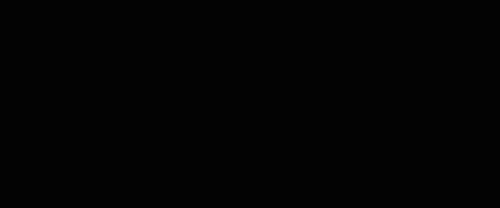

# An analysis of the behaviour of the digital rain in The Matrix

The purpose of this document is to share an understanding of the behaviour and appearance of the iconic digital rain visual effect used in The Matrix. This can be used to provide a guide of sorts when attempting to emulate the effect.

This document is a work in progress:

- [x] Behaviour
    - [x] Falling code
    - [x] Changing glyphs
    - [x] Deletion strings
    - [x] Highlighted glyphs
- [ ] Composition
    - [ ] Grid
    - [ ] Glyphs used
    - [ ] Typeface
    - [ ] Colours

The sample used for study is that in the opening sequence of the first movie.

This analysis does not include other samples for the following reasons:

* The digital rain behaves differently in the sequels
* This is the clearest and most iconic example of the effect

## Glossary

* **Digital rain** or **code**: The overall visual effect used to demonstrate the underlying code of The Matrix
* **Glyph**: A single text character
* **String**: An unbroken set of glyphs in a single column
* **Frame**: A single moment of the animation

## Animation

### Falling code

At first glance the glyphs appear to move down from the top to the bottom of the screen, however, the first thing to notice when isolating a single string is that the glyphs themselves do not descend:

Except for changing glyphs, they remain in place, and different glyphs appear beneath them.

Additionally, it appears that the strings don't always originate from the top of the screen:

It looks as though new strings are being created at points lower down the screen. However, the pauses in time between these strings appearing suggest that invisible characters exist. For instance, if we were to insert a placeholder character in locations which we predict a character for that frame, we can see the pattern:

We can therefore assume that the first of the visible glyphs in this string did not spawn in the middle of the screen, but was also preceded by invisible characters.

### Changing glyphs

Some glyphs remain static for three frames, and then change into another glyph:

During a single frame, the new and old glyph occupy the same space, each at 50% opacity. All changing glyphs change on the same frame. Some strings consist entirely of changing glyphs.

### Deletion strings

Deletion strings only generate invisible characters. Unlike regular strings, deletion strings can appear over the top of existing strings. While we cannot see the deletion string itself, we can see evidence of it when an existing string disappears:

### Highlighted glyphs

Roughly 1 in 5 strings have highlighted glyphs. Only a single glyph of a string is highlighted at a given time, and that glyph is leading glyph of the string:

The only exception to the above rule of only a single glyph of a string being highlighted at a given time, is that every so often, all highlighted glyphs will stammer at the same time. The stammer causes strings with highlighted glyphs to fall behind other strings by a single row:

| Frame  | Leading glyph            | Second to leading glyph | String length |
| ------ | ------------------------ | ----------------------- | ------------- |
| 0      | Highlighted              | Normal                  | 1             |
| 1      | Partially highlighted    | Partially highlighted   | 2             |
| 2      | Highlighted              | Normal                  | 2             |
| 3      | Highlighted              | Normal                  | 3             |
